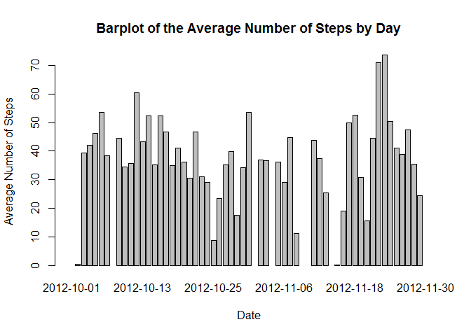
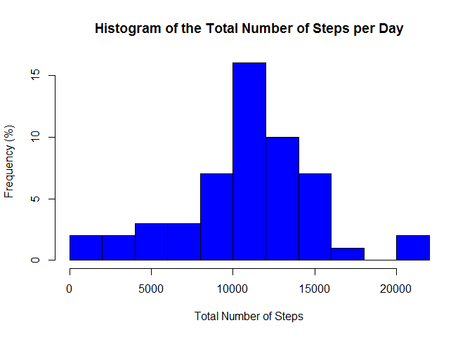
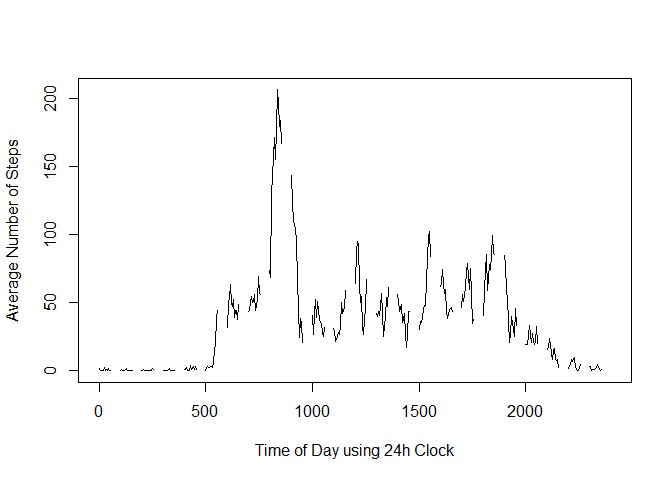
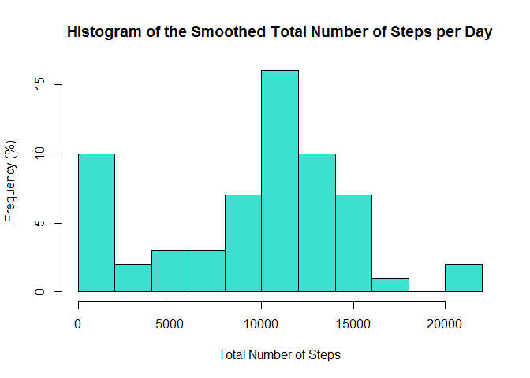

# Reproducible Research: Peer Assessment 1
Robert Turner  
December 20, 2015  

This assignment makes use of data from a personal activity monitoring device. This device collects data at 5 minute intervals through out the day. The data consists of two months of data from an anonymous individual collected during the months of October and November, 2012 and include the number of steps taken in 5 minute intervals each day.

As part of this assignment, the following processing steps and analyses will be performed:

* Load and preprocess the 'raw' activity.csv file. 
* Calculate the mean total number of steps taken per day (ignoring NAs). 
* Calculate and plot the average daily activity pattern. 
* Approximate synthetic 'step' values to replace NA values. 
* Investigate whether there are differences in activity patterns between weekdays and weekends.  

***
### Load and preprocess the 'raw' activity.csv file

```r
library(lubridate)
activity_data <- read.csv("activity.csv")

# Convert the dates into POSIX class objects using lubridate
activity_data$date  <- ymd(activity_data$date)

head(activity_data)
```

```
##   steps       date interval
## 1    NA 2012-10-01        0
## 2    NA 2012-10-01        5
## 3    NA 2012-10-01       10
## 4    NA 2012-10-01       15
## 5    NA 2012-10-01       20
## 6    NA 2012-10-01       25
```

```r
summary(activity_data)
```

```
##      steps             date               interval     
##  Min.   :  0.00   Min.   :2012-10-01   Min.   :   0.0  
##  1st Qu.:  0.00   1st Qu.:2012-10-16   1st Qu.: 588.8  
##  Median :  0.00   Median :2012-10-31   Median :1177.5  
##  Mean   : 37.38   Mean   :2012-10-31   Mean   :1177.5  
##  3rd Qu.: 12.00   3rd Qu.:2012-11-15   3rd Qu.:1766.2  
##  Max.   :806.00   Max.   :2012-11-30   Max.   :2355.0  
##  NA's   :2304
```

***
### Calculate the mean total number of steps taken per day (ignoring NAs)

```r
# Create a vector of POSIX days
days <- ymd(seq(from=as.Date('2012-10-01'), to=as.Date("2012-11-30"), by='days' ))

total_per_day = integer()
avg_per_day = numeric()

for (x in 1:(length(days))) { total_per_day[x] = (sum(activity_data$steps[activity_data$date == days[x]], rm.na = T)) }

for (x in 1:(length(days))) { avg_per_day[x] = (mean(activity_data$steps[activity_data$date == days[x]], rm.na = T)) }

# Create a data frame with the intervals and average steps taken
avg_daily_activity  <- data.frame(date = days, average_steps = avg_per_day, total_steps = total_per_day)

# Plot the average steps using the base package
barplot(avg_daily_activity$average_steps,
        names.arg = avg_daily_activity$date,
        main = "Barplot of the Average Number of Steps by Day",
        xlab = "Date",
        ylab = "Average Number of Steps")
```

 

```r
# Plot a histogram of the total steps per day
hist(total_per_day, 
     main = "Histogram of the Total Number of Steps per Day",
     xlab = "Total Number of Steps",
     ylab = "Frequency (%)",
     breaks = 10, col = "blue")
```

 

```r
# Report the mean and median of total steps per day
total_mean <- mean(total_per_day, na.rm = TRUE)
total_median <- median(total_per_day, na.rm = TRUE)
```
The **mean** of the total steps taken per day is 1.0767189\times 10^{4}.  
The **median** of the total steps taken per day is 10766.  

***
### Calculate and plot the average daily activity pattern

```r
# Calculate averages by interval and assign them to a temporary vector
avg_per_interval <- numeric()

for (x in 1:472) { avg_per_interval[x] = (mean(activity_data$steps[activity_data$interval == ((x-1)*5)], na.rm = T)) }

# Create a data frame with the intervals and average steps taken
avg_interval_activity  <- data.frame(interval = seq(0,2355, by = 5), average_steps = avg_per_interval)

# Plot the average steps using the base package
plot(avg_interval_activity$interval, 
     avg_interval_activity$average_steps, 
     type = "l", xlim = c(0, 2400),
     xlab = "Time of Day using 24h Clock",
     ylab = "Average Number of Steps")
```

 

***
### Approximate synthetic 'step' values to replace NA values

```r
# Replace the NAs with representative values
# This is done by searching for the next interval that has
# data and assigning that value to the NA.
# This assumes data that are temporally close together
# will be more similar and act as a better proxy than
# just replacing the NA with the daily interval average.

# This code could almost certainly be more concise and elegant, I apologize.

smoothed_steps <- numeric()

nrows <- (length(activity_data$steps))

# First populate the new vector with data we know is good
for (x in 1:nrows) {
  if (is.na(activity_data$steps[x]) == FALSE) {
        smoothed_steps[x] = activity_data$steps[x]
  } 
}

# Next, replace NAs by looping up to the next valid data point
for (x in 1:nrows) {
  if (is.na(smoothed_steps[x]) == TRUE) {
    for (y in x:nrows) {
      if (is.na(activity_data$steps[y]) == FALSE) {
        smoothed_steps[x] = activity_data$steps[y]
        break
      }
    }
  }
}

# Sometimes looping up will get you to the end of the data
# without finding a good data point, so we replace remaining NAs by 
# looping Down to the last valid data point.  
for (x in 1:nrows) {
  if (is.na(smoothed_steps[x]) == TRUE) {
    for (y in x:1) {
      if (is.na(activity_data$steps[y]) == FALSE) {
        smoothed_steps[x] = activity_data$steps[y]
        break
      }
    }
  }
}

activity_data$smoothed_steps <- smoothed_steps
head(activity_data)
```

```
##   steps       date interval smoothed_steps
## 1    NA 2012-10-01        0              0
## 2    NA 2012-10-01        5              0
## 3    NA 2012-10-01       10              0
## 4    NA 2012-10-01       15              0
## 5    NA 2012-10-01       20              0
## 6    NA 2012-10-01       25              0
```

```r
total_per_day_smoothed = integer()

for (x in 1:(length(days))) { total_per_day_smoothed[x] = (sum(activity_data$smoothed_steps[activity_data$date == days[x]], rm.na = T)) }

# Plot a histogram of the total steps per day
hist(total_per_day_smoothed, 
     main = "Histogram of the Smoothed Total Number of Steps per Day",
     xlab = "Total Number of Steps",
     ylab = "Frequency (%)",
     breaks = 10, col = "turquoise")
```

 

```r
# Report the mean and median of total steps per day
total_mean_smoothed <- mean(total_per_day_smoothed)
total_median_smoothed <- median(total_per_day_smoothed)
```
The **mean** of the smoothed total steps taken per day is 9355.2295082.  
The **median** of the smoothed total steps taken per day is 1.0396\times 10^{4}. 

***
### Investigate whether there are differences in activity patterns between weekdays and weekends

```r
# Nothing to see here...
```
